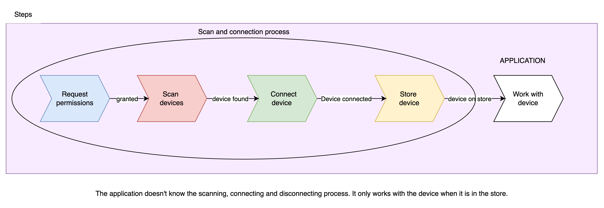

# React Native BLE-PLX full example


## Introduction

This application demonstrates how to connect Bluetooth Low Energy (BLE) devices to a React Native app using `react-native-ble-plx`, `Zustand`, and `TypeScript`. It provides a structured approach to manage BLE connections, keep the application agnostic to the underlying Bluetooth processes, and ensure seamless device management.

The goal is to offer a clean architecture where the app can handle BLE devices transparently, allowing you to easily manage BLE connections without coupling the core logic of your app with Bluetooth-specific implementations.

## Get Started

1. Install dependencies:

   ```bash
   yarn
   ```

2. Build application:
   ```bash
   yarn expo prebuild --clean
   ```
3. Start the app:

   ```bash
   yarn start
   ```

## Features

- **Automatic Device Scanning**: Automatically searches and connects to BLE devices based on predefined characteristics.
- **Connection Management**: Handles BLE connections and disconnections in a clean, maintainable way.
- **Store Integration with Zustand**: BLE device states are stored using Zustand, making the app state predictable and reactive.
- **Cross-Platform Support**: Works on both Android and iOS, requesting necessary permissions dynamically.

## Technologies Used

- **React Native**
- **Expo**
- **react-native-ble-plx**
- **Zustand**
- **TypeScript**
- **Jest**
- **React Testing Library**

## Diagrams

### Steps



### Flow


## Author

**Santi Tabbach**

- [LinkedIn](https://www.linkedin.com/in/santiago-tabbach/)
- tabbach97@gmail.com
